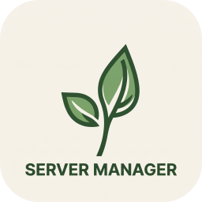

# LeviLamina Server Manager

<div align="center">



**A modern, high-performance GUI management suite for Minecraft: Bedrock Dedicated Server powered by LeviLamina.**

[](https://go.dev/)
[](https://wails.io/)
[](https://react.dev/)
[](LICENSE)
[](https://microsoft.com)

[Features](#features) • [Quick Start](#quick-start) • [Architecture](#architecture) • [Building](#building-from-source) • [Documentation](ARCHITECTURE.md) • [Contributing](CONTRIBUTING.md)

</div>

---

## Overview

**LeviLamina Server Manager** (LLSM) is a full-featured desktop management platform engineered specifically for **LeviLamina**-enabled Minecraft Bedrock Dedicated Servers (BDS). It combines low-level Windows process supervision, real-time UDP RakNet engine telemetry, automated addon deployment, and native `lip` package manager integration within an intuitive, modern user interface.

Whether managing a personal development sandbox or a high-concurrency production realm, LLSM eliminates repetitive CLI administration, guarantees clean process termination via OS-level Job Objects, and provides complete observability over server performance.

---

## Features

### 🚀 Core Server Management
- **Single-Click Lifecycle**: Launch, gracefully stop, restart, or kill BDS instances with safe world flush.
- **Process Guard & Crash Recovery**: Monitors server PID health and automatically detects crash loops or unexpected unloads.
- **Zero-Orphan Process Guarantee**: Utilizes Windows Job Objects (`AssignProcessToJobObject`) to ensure child BDS processes terminate cleanly when the manager exits or uninstalls.
- **Console Virtualization**: Real-time terminal with ANSI color decoding, auto-scrolling buffer protection, and command dispatch.

### ⏱️ Real-Time Telemetry & Diagnostics
- **Accurate Bedrock TPS & MSPT**: Queries the Bedrock RakNet engine loop directly via local UDP packets and OS thread timing, eliminating static or fabricated metrics.
- **System Resource Monitoring**: Live CPU usage %, private working set RAM (MB), active player counts, and network I/O.
- **Audit Logging**: Persistent activity log buffer (`~/.llsm/activity.log`) recording server state transitions, security events, backup routines, and configuration modifications.

### 📦 Ecosystem & Extension Management
- **`lip` Package Manager Integration**: Seamlessly search, install, upgrade, and remove LeviLamina plugins and libraries directly from remote repositories.
- **Add-on Installer Engine**: Transactional installer for `.mcpack` and `.mcaddon` archives. Automatically parses UUIDs, verifies manifest version requirements, and maps behavior/resource packs to specific world states (`world_behavior_packs.json`).
- **Bedrock Marketplace & ToolCoin Catalog**: Integrated content catalog with automatic semantic version extraction (`v1.2.2`), live downloading progress bars, and pack inspection.

### 🌍 World & Backup Protection
- **Scheduled & On-Demand Backups**: Fast ZIP compression engine with timestamped retention rules and pre-flight space verification.
- **World Management**: Inspect LevelDB worlds, switch active levels, configure gamerules, and clone world states.

---

## Quick Start

### Pre-built Binaries
Download the latest Windows installer (`LeviLaminaServerManager-amd64-installer.exe` or `setup.exe`) from the [Releases](https://github.com/LiteLDev/LeviLaminaServerManager/releases) page and run the setup wizard.

### System Requirements
- **OS**: Windows 10 / Windows 11 (64-bit AMD64)
- **Runtime**: WebView2 Runtime (pre-installed on modern Windows)
- **Minecraft**: Bedrock Dedicated Server (BDS) 1.20+ with or without LeviLamina

---

## Building from Source

### Prerequisites
Make sure your development machine has the following installed:
- [Go 1.21+](https://go.dev/dl/)
- [Node.js 18+](https://nodejs.org/) (with `npm`)
- [Wails CLI v2](https://wails.io/docs/gettingstarted/installation):
  ```bash
  go install github.com/wailsapp/wails/v2/cmd/wails@latest
  ```
- [NSIS 3.0+](https://nsis.sourceforge.io/) *(Optional, required only for building the installer)*

### One-Click Build
Run the automated build script in the repository root:

**Using Command Prompt:**
```cmd
build.bat nsis      :: Builds the full installer
build.bat exe       :: Builds standalone executable
build.bat dev       :: Launches hot-reload development mode
```

**Using PowerShell:**
```powershell
.\build.ps1 -Target nsis
.\build.ps1 -Target dev
```

### Manual Compilation
```bash
# 1. Install frontend packages
cd frontend
npm install
cd ..

# 2. Verify Go modules
go mod tidy

# 3. Compile standalone application
wails build -platform windows/amd64

# 4. Or compile with NSIS installer
wails build -platform windows/amd64 -nsis
```

Outputs will be placed in the `build/bin/` directory.

---

## Project Structure

```
.
├── backend/                  # Core application engine (Go)
│   ├── activity/             # Persistent activity logging & streaming
│   ├── addons/               # .mcpack / .mcaddon archive analyzer & installer
│   ├── backups/              # Automated server backup engine
│   ├── bedrinth/             # Bedrinth marketplace & addon API client
│   ├── compatibility/        # Version compatibility matrix (BDS vs LeviLamina)
│   ├── extensions/           # ToolCoin / Bedrock marketplace content catalog
│   ├── levilamina/           # LeviLamina release checker & injection loader
│   ├── lip/                  # 'lip' CLI package manager integration
│   ├── models/               # Shared domain entities & data contracts
│   ├── process/              # BDS supervisor, Windows Job Object, RakNet metrics
│   ├── security/             # Preflight integrity checks & token isolation
│   ├── server/               # Server profile management (server.properties)
│   ├── updates/              # BDS and manager update checking
│   ├── worlds/               # LevelDB world management & gamerules
│   └── app.go                # Wails IPC bridge & runtime controller
├── build/                    # Build configuration, icons, & NSIS scripts
│   └── windows/installer/    # NSIS custom modern setup wizard
├── frontend/                 # User Interface (React 18 + TypeScript + Vite)
│   ├── src/
│   │   ├── components/       # Reusable UI widgets & modals
│   │   ├── pages/            # Application views (Dashboard, Addons, Logs, etc.)
│   │   ├── services/         # Wails backend API bindings & IPC callers
│   │   └── i18n/             # Multilingual translations (en, ar, zh)
├── build.bat                 # Windows CMD one-click build script
├── build.ps1                 # Windows PowerShell one-click build script
├── ARCHITECTURE.md           # In-depth architectural documentation
├── CONTRIBUTING.md           # Developer guidelines & code conventions
├── wails.json                # Wails v2 project configuration
└── go.mod                    # Go dependencies definition
```

---

## Contributing

We welcome contributions from the community! Please read our [Contributing Guide](CONTRIBUTING.md) for details on code style, branch naming, and submitting pull requests.

---

## License

LeviLamina Server Manager is licensed under the [GNU General Public License v3.0](LICENSE).  
Minecraft is a trademark of Mojang Synergies AB. This project is not affiliated with or endorsed by Mojang or Microsoft.
